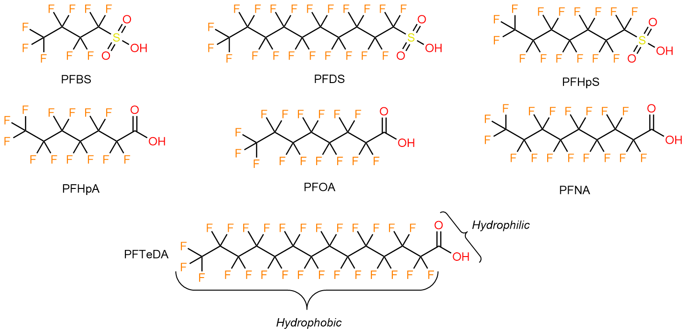
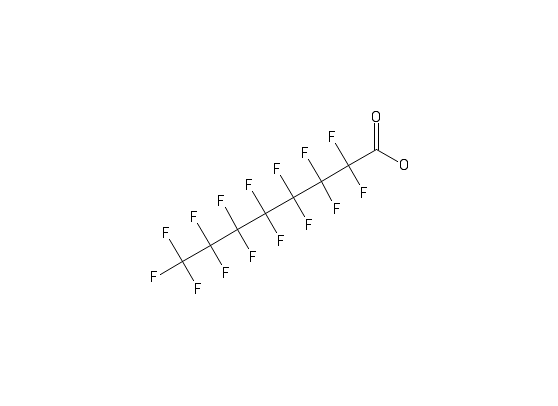

```{r setup, include=FALSE}
knitr::opts_chunk$set(echo = TRUE)
```
***************

Howdy!

This handout is meant to accompany the September 18th lecture, and Assignement 2. In it, we'll be familiarizing (or introducing) ourselves to the world of cheminformatics. We'll discuss this in more detail as we work through this exercise, but for now it simply means we'll make use of *in silico* (i.e. computers) techniques to tackle problems in environmental chemistry. 

# Objectives

At the start of this exercise you'll be randomly assigned an environementally relevant chemical pollutant. **Note**, you'll be working with your assigned chemical throughout the remaining environmental chemistry section of the course. You'll then compare your unique chemical against a short list of 6 perfluoroalkyl substances (PFAS). 

At the end of the exercise you should have the following:

1. A saved .csv file with the relevant molecular descriptors of your unique chemical and the short-list of PFAS compounds
2. A plot that explores the relationship between the molecular descriptors of your unique chemical and the short-list of PFAS compounds
3. A brief written analysis where you hypothesis/rationalize the results of your plot. Don't worry to much about being technically correct (boring), we're looking more for curiosity and neat ideas (what the world actually needs). 
4. All of the above written in an R markdown document and submitted as a PDF (like this one!).


# Obtaining your assigned chemicals

Before starting the R section of this lab, please complete the "Chemical Assignment Quiz" on Quercus. It's called a "quiz" because of the way Quercus works, but really it simply assigns you a random chemical from a list and keeps track of it for us (the instructors) to reference later on. 

After the quiz you should have an assigned chemical (ex. *perfluorooctanoic acid*), it's abbreviated name (ex. *PFOA*) and it's CAS number (ex. *335-67-1*). Please keep track of your assigned values to prevent numerous headaches for all us down the line. 

# Packages needed for this lab

We'll be using the `webchem` and `tidyverse` packages from the CRAN repository. If you haven't already installed them you can run the following code in the console below or install them using the "Install" button under the "Packages" tab in the bottom right window of R Studio. 

```{r, eval = FALSE}
install.packages("tidyverse") # contains several packages such as dplyr and ggplot2.
install.packages("webchem")

```

After you've installed the packages, load them into your current R session by running the code below. 

```{r, echo = TRUE, message = FALSE }
library(webchem) 
library(tidyverse) 
```

The `tidyverse` is a collection of R packages written by H. Wickham et al. They work synergistically to streamline data analysis in R. `ggplot2` is an example of a tidyverse package, but there's so much more to the tidyverse then that. Read more at [tidyverse.org](https://www.tidyverse.org/) and please look into the *R for Data Science* book by Wickham and Grolemund (2017) to learn more. The book can be found online at [r4ds.had.co.nz/](https://r4ds.had.co.nz/).

The `webchem` package was written by E. Szocs et al. and allows the importation of chemical information from a variety of online databases. [Example vignettes](https://cran.r-project.org/web/packages/webchem/vignettes/webchem.html) using `webchem` and the [package  reference manual](https://cran.r-project.org/web/packages/webchem/webchem.pdf) are hosted on CRAN.    

# Importing your data into R

All of the data we'll be using for this exercise can be found freely on [PubChem](https://pubchem.ncbi.nlm.nih.gov/), an open chemistry database focusing on small molecules, their chemical structures, identifiers, toxicity data and more. You can go to [pubchem.ncbi.nlm.nih.gov](https://pubchem.ncbi.nlm.nih.gov/) and search up your assigned chemical/CAS and be inundated with information. This approach is great to look up one or two compounds, but building up a dataset this way not only becomes tedious, but unreliable. Some of the work in the Peng group investigates over 80 000 unique chemicals in consumer products; obviously a manually intensive approach is impossible. 

So to that end, we'll import a data set of compounds, add our/your unique chemical to it, then use the `webchem` package from R to build up our dataset. Let's start by constructing our `data.frame`, before we expand it using `webchem`. 

```{r}

# Importing example dataset, found on Quercus

df <- read.csv("data/ExamplePFAS.csv", header = TRUE)

df
```

So we see we have a `data.frame` consisting of four columns, and six example chemicals. Let's move on and add our unique chemical to it. 

**Top Tip**: As shown above, we've returned our `data.frame` to the console. In R studio you can also view `data.frames`, `matrices`, and `lists` from the "Environment" tab in the upper right corner or with the command: `View(yourDatasNameHere)`. A new tab will appear in R studio with your data. You can also "tear" the tab away (click and drag) to get a new window. Now you can view the data you're trying to manipulate while you code. This is a lot easier to work with then scrolling back up through the console window. 

**Note** that throughout the remainder of this handout *perfluorooctanoic acid (PFOA, CAS 335-67-1) is used as a placeholder for your assigned compound*. You can copy the code into your R studio session and replace values accordingly. 

```{r}

# We'll use the tidyverse with add_row rather than the base R style.
# Note how we're reassigning our newly created dataset to our original data frame. 

df <- df %>% add_row(Project = "David", 
                     Name = "Perfluorooctanoic acid",
                     Abbreviation = "PFOA", 
                     CAS = "335-67-1")

df
```

Great, we can see our returned `data.frame` and everything looks to be in place. *Make sure your `data.frame is properly setup*. 

**Top Tip**: We made use of the pipe operator, `%>%`, a powerful tool for clearly expressing a sequence of multiple operations. The way you would read the code above is "We're adding a row to `df` and reassigning the newly created data.frame to the variable `df`". Take note of the pipe, but don't worry about how it works for now, we'll discuss it later on. Inquiring minds can read more about the pipe in [Chapter 18 of *R for Data Science*](https://r4ds.had.co.nz/pipes.html)

## What's in our dataset anyways?

Whenever working with chemical data, it's always a good idea to look at the actual molecular structures in question. The structure of the seven compounds in the example dataset are shown in Figure 1. 



These seven compounds belong to a class of persistent organic pollutants known as *per-* and *polyfluoroalkyl substances* (PFAS). Their classification, and unique properties, derive from the extremely hydrophobic carbon-fluorine bonds (-CF~2~ & -CF~3~). Hydrophobic means "water hating" or repelling; think oil on water. For example, the non-stick properties of Teflon derive from the hydrophobicity of its carbon-fluorine bonds. However, the compounds in Figure 1 also have *hydrophilic* (water loving) head-groups. These act to counter balance the hydrophobic -CF~x~ "tail" and improves the overall solubility (ability to dissolve in water) of the molecule. We'll talk more about solubility later on. 

# Obtaining molecular descriptors from PubChem

It might not be apparent to you, but there is a wealth of information in the chemical structures of compounds. However, transforming this into a useful data for computational analysis requires the use of molecular descriptors. "[M]olecular descriptor [are] the final result of a logic and mathematical procedure which transforms chemical information encoded within a symbolic representation of a molecule into a useful number or the result of some standardized experiment."^[Roberto Todeschini and Viviana Consonni, *Handbook of Molecular Descriptors*, Wiley-VCH, 2000. http://www.moleculardescriptors.eu/books/handbook.htm] 

So let's fetch ourselves some relevant molecular descriptors from PubChem using `webchem`. We can also calculate these, and many more descriptors, using `R` and cheminformatics packages such as `rcdk` or `chemminer`. Unfortunately, these calculations are pretty computationally demanding, so we'll settle for what we can get from PubChem. 

```{r, eval = FALSE}
# Extracting CAS numbers from our data.frame

CAS <- as.vector(df$CAS)

# Getting the PubChem ID from CAS numbers
# You need an internet connection; may take a minute
cids <- get_cid(CAS) 

# Getting descriptors from PubChem; there's ~30 so we'll specify what we need 
Descriptors <- pc_prop(cids$cid,
             properties = c("MolecularFormula",
                            "MolecularWeight",
                            "CanonicalSMILES",
                            "IUPACName",
                            "XLogP",
                            "MonoisotopicMass",
                            "TPSA", # total polar surface area
                            "Charge",
                            "Volume3D"))

# Combining everything into one file for subsequent lectures
dataPubChem <- cbind(df,Descriptors)

# Saving data so we don't need to recall values from PubChem
write.csv(dataPubChem, 
          file = "data/DavidExamplePubChem.csv",
          row.names = FALSE)
```

```{r, echo = FALSE, message=FALSE}
dataPubChem <- read.csv("data/DavidExamplePubChem.csv", header = TRUE)
```

If you successfully ran the code above, you should now have a `data.frame` with 9 additional columns named: ``r colnames(dataPubChem)[4:ncol(dataPubChem)]``. And you should have a saved your `data.frame` into a .csv file. Every time you run the `pc_prop` function, you ping the PubChem database, which takes some time. Saving our results means avoids this the next time we pick up our work. 

Some of the descriptors we added to our `data.frame` are self-descriptive, and others we'll touch upon later on. For now let's look at a couple:

- *MolecularWeight*: this is the formula weight of a given chemical in *g/mol*. This is the same weight you used in *CHM 135* or *CHM 136*
- *Charge*: The formal charge of the chemical; `0` is neutral. 
- *IUPACName*: this is the "official" chemical name, based on rules like you encountered in intro chem classes. What a mouthful. 
- *XLogP*: The octanol/water partition coefficient, a measure of how "hydrophilic" or "hydrophobic" a compound is. **The higher the *LogP* value, the greater the hydrophobicity.** 
  - *XLogP* is  calculated computational by PubChem using the *XLogP3* method.^[Cheng, et al. *J. Chem. Inf. Model*, **2007**, *47*(6):2140-8. doi: 10.1021/ci700257y.] 
  - *LogP* is calculated experimentally by measuring the concentration of a solute in an immiscible mixture of octanol and water; the actual formula is:  $LogP = log(\frac{[solute]_{octanol} }{[solute]_{water}})$, see Figure 3.
- *CanonicalSMILES*: SMILES stands for *simplified molecular-input line-entry system*; essentially it's a way to describe the structure of a chemical in a string. The *XlogP3* method mentioned above starts with SMILES data to calculate LogP.  

## How does solubility work? 

Solubility is the ability of a chemical compound to dissolve in a liquid. You may have head of the saying: "like dissolves like". The "like" in the saying refers to the polarity of your solute (what you're dissolving) and your solvent (what you're dissolving your solute into). When discussing environmentally relevant chemistry, unless otherwise stated, we'll be discussing solubility in water, a polar solvent. Correspondingly, the more polar a molecule is, the more it will dissolve into water. Molecules with a net formal charge (i.e. ions) are typically very soluble. 

This begs the questions: "What is a polar molecule?". Recall that all molecules are composed of atoms sharing electrons. Well some atoms are greedier then others, and the sharing of electrons isn't an even split. The "greediness" of an atom for electrons is called **electronegativity**. A bond between atoms of unequal electronegativity will have a partially negative charge towards the more electronegative element and a partially positive charge towards the less electronegative element. This is called an electric **dipole moment**. However, *if a molecule is symmetrical, the dipole moments will cancel each other out*. **A molecule with two or more polar bonds must be asymmetrical in at least one direction to exhibit polar characteristics.** See Figure 2 for the relative elemental electronegativities, and examples of dipole moments in molecules. 

Lastly, many molecules don't fit neatly into the "polar vs. non-polar" categories. Some have parts that are polar and other parts that are non-polar. This makes them **ampiphilic molecules**. It's a battle between how polar are the polar regions and how non-polar are the non-polar regions which dictates the molecule's solubility in water. Ampiphilic molecules with clearly defined regions of polarity and non-polarity are called **surfactants** and like to hang around the interface between two liquids or a liquid and a gas. The PFAS compounds we saw earlier are examples of surfactants. 

The [*Chemical Polarity* Wikipedia page](https://en.wikipedia.org/wiki/Chemical_polarity) is a good place to start if you want to know more about polarity. Don't worry so much about specifics, rather concentration on trends. Likewise, we won't worry about saturation limits, gaseous diffusion, temperature effects,  etc.  when discussing solubility in this course due to the relatively minute concentration of our compounds of interest. 


## What does LogP mean?

LogP is the octanol/water partition coefficient. It's the ratio of a compound in the mixture octanol (non-polar) and water (polar). These two solvents are immiscible, and form two distinct layer; think oil on water. It's essentially a measure of how hydrophilic a compound is; **the higher the LogP, the lower it's solubility in water**. Figure 4 shows a simplification of this process. Thankfully, LogP can readily be calculated/predicted using computational meethods, subverting the needs for empirical measurements. 

{width=75%}

Partition coefficients can be calculated between any two liquids; the air/water partition, LogK~aw~, is another useful measurement in environmental chemistry. LogP is used, because octanol has similar hydrophobic properties to cellular membranes and fatty tissues, making LogP easy to measure and useful for predicting the distribution of drugs and pollutants in animals/soil. 

# Viewing the molecular structure of your compound

Unfortunately it's rather cumbersome to translate SMILES information into visual structures using R. However, you can view the structure of your compound from it's SMILES using any number of online resources. For example, using the [PubChem Sketcher](https://pubchem.ncbi.nlm.nih.gov/edit3/index.html) and the PFOA SMILES, we get the following image: 

{width=50%}

While we're only using SMILES information to draw the structure, so much more can be done with it. We can calculate hundreds of molecular descriptors, analyze trends in massive data bases of chemical compounds, and make numerous prediction using a variety of models. If you continue to pursue anything related to chemistry, you're bound to come across SMILES notation at some point. 

# Quick data exploration of our compounds

If you haven't noticed already, each column corresponds to a variable, and each row is an observation. When data is organized like this in R, it's called *tidy* data (hence *tidyverse*). Let's explore our data through graphical visualization using `ggplot2`, a tidyverse package. 

`ggplot2` can plot both discrete variables (i.e. categories, ex: Male or Female) or continuous variables (i.e. numbers, ex: weight). Were limited in our dataset to the descriptors we've called, so **let's focus on plotting molecular weight vs. solubility** because it's the most interesting. 


```{r, fig.cap = "Plot of molecular weight vs LogP."}
library(ggrepel) # improves point annotation from baseline ggplot

ggplot(data = dataPubChem,      # specifcying the data frame we created earlier
       aes(x = MolecularWeight, # note how each value here is a column name
           y = XLogP,
           colour = Project,
           label = Abbreviation)) +
  geom_point() +      # specifying we want to create a scatter plot
  geom_label_repel()  # creates the labels for each point using the ggrepel package
```

## What does our MW vs. LogP plot tell us? 

The entire point of visualizing information is to help observe trends and patterns we might not otherwise see. With that in mind, look again at Figure 3 or your own plot and start jotting down some observation. Some observations include:

- There is a positive correlation between molecular weight and LogP among the compounds we plotted. We can easily see that PFTeDA is less soluble in water (higher LogP) than PFDS. 
- PFHpS is between PFOA and PFNA in terms of molecular weight, but has a lower LogP, almost equal to PFHpA.
- PFOA weights halfway between PFHpA and PFNA, and it's LogP is also half-way between PFHpA and PFNA. 

Question your observations and ask yourself if they make sense. Does it make sense that PFTeDA is less soluble than PFNA? When you create your own plot with you assigned chemical, ask yourself if it fits this trend. If not, why not? Don't dig too deep into the chemical theory, just remember to look at the structures (Figure 1, and the one you made from your SMILES). Also look at the other descriptors in your dataset, such as the formal charge, to explain some of the trends.  

## Implications of plotting with ggplot2

The "gg" in `ggplot2` stands for "grammar of graphics". The theory being that all plots from the same few components: data, aesthetics, coordinates, and geoms. In the code used to generate Figure 3, our data is the `dataPubChem` data frame we made earlier. The aesthetics were passes through `aes(...)`, with the *x* and *y* values creating our coordinate system. The other two aesthetics elements, *colour* and *label*, were passed to `geom_point` and `geom_label`, respectively. Recall that all of the aes elements correspond to a column name. Because our data is tidy, we can easily incorporate more dimensions to our plot. For example if we added `size = Volume3D` to the `aes(...)` elements, the size of a individual points would vary with that chemicals Volume3D value. 

Every plot you generate with `ggplot2` will have a similar structure. There are a plethora of options when creating plots with `ggplot2`. Consult the [official R studio ggplot2 cheat sheet](https://rstudio.com/wp-content/uploads/2015/03/ggplot2-cheatsheet.pdf) to get some more ideas of how you can modify your graphs to better communicate information. 


