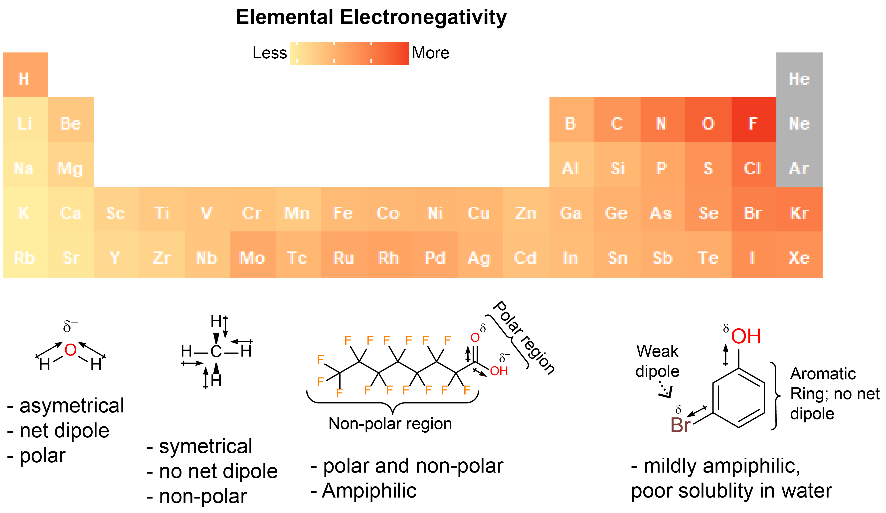
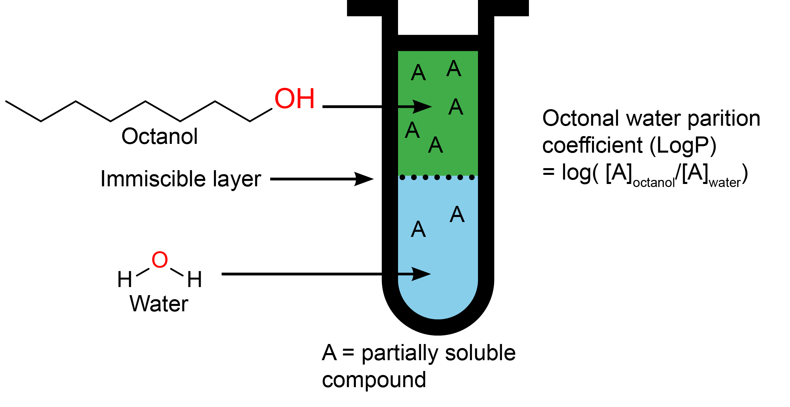

```{r setup, include=FALSE}
knitr::opts_chunk$set(echo = TRUE)
```
***************

# Obtaining molecular descriptors from PubChem

It might not be apparent to you, but there is a wealth of information in the chemical structures of compounds. However, transforming this into a useful data for computational analysis requires the use of molecular descriptors. "[M]olecular descriptor [are] the final result of a logic and mathematical procedure which transforms chemical information encoded within a symbolic representation of a molecule into a useful number or the result of some standardized experiment."^[Roberto Todeschini and Viviana Consonni, *Handbook of Molecular Descriptors*, Wiley-VCH, 2000. http://www.moleculardescriptors.eu/books/handbook.htm] 

So let's fetch ourselves some relevant molecular descriptors from PubChem using `webchem`. We can also calculate these, and many more descriptors, using `R` and cheminformatics packages such as `rcdk` or `chemminer`. Unfortunately, these calculations are pretty computationally demanding, so we'll settle for what we can get from PubChem. 

```{r, eval = FALSE}
# Extracting CAS numbers from our data.frame

CAS <- as.vector(df$CAS)

# Getting the PubChem ID from CAS numbers
# You need an internet connection; may take a minute
cids <- get_cid(CAS) 

# Getting descriptors from PubChem; there's ~30 so we'll specify what we need 
Descriptors <- pc_prop(cids$cid,
             properties = c("MolecularFormula",
                            "MolecularWeight",
                            "CanonicalSMILES",
                            "IUPACName",
                            "XLogP",
                            "MonoisotopicMass",
                            "TPSA", # total polar surface area
                            "Charge",
                            "Volume3D"))

# Combining everything into one file for subsequent lectures
dataPubChem <- cbind(df,Descriptors)

# Saving data so we don't need to recall values from PubChem
write.csv(dataPubChem, 
          file = "data/DavidExamplePubChem.csv",
          row.names = FALSE)
```

```{r, echo = FALSE, message=FALSE}
dataPubChem <- read.csv("data/DavidExamplePubChem.csv", header = TRUE)
```

If you successfully ran the code above, you should now have a `data.frame` with 9 additional columns named: ``r colnames(dataPubChem)[4:ncol(dataPubChem)]``. And you should have a saved your `data.frame` into a .csv file. Every time you run the `pc_prop` function, you ping the PubChem database, which takes some time. Saving our results means avoids this the next time we pick up our work. 

Some of the descriptors we added to our `data.frame` are self-descriptive, and others we'll touch upon later on. For now let's look at a couple:

- *MolecularWeight*: this is the formula weight of a given chemical in *g/mol*. This is the same weight you used in *CHM 135* or *CHM 136*
- *Charge*: The formal charge of the chemical; `0` is neutral. 
- *IUPACName*: this is the "official" chemical name, based on rules like you encountered in intro chem classes. What a mouthful. 
- *XLogP*: The octanol/water partition coefficient, a measure of how "hydrophilic" or "hydrophobic" a compound is. **The higher the *LogP* value, the greater the hydrophobicity.** 
  - *XLogP* is  calculated computational by PubChem using the *XLogP3* method.^[Cheng, et al. *J. Chem. Inf. Model*, **2007**, *47*(6):2140-8. doi: 10.1021/ci700257y.] 
  - *LogP* is calculated experimentally by measuring the concentration of a solute in an immiscible mixture of octanol and water; the actual formula is:  $LogP = log(\frac{[solute]_{octanol} }{[solute]_{water}})$, see Figure 3.
- *CanonicalSMILES*: SMILES stands for *simplified molecular-input line-entry system*; essentially it's a way to describe the structure of a chemical in a string. The *XlogP3* method mentioned above starts with SMILES data to calculate LogP.  

## How does solubility work? 

Solubility is the ability of a chemical compound to dissolve in a liquid. You may have head of the saying: "like dissolves like". The "like" in the saying refers to the polarity of your solute (what you're dissolving) and your solvent (what you're dissolving your solute into). When discussing environmentally relevant chemistry, unless otherwise stated, we'll be discussing solubility in water, a polar solvent. Correspondingly, the more polar a molecule is, the more it will dissolve into water. Molecules with a net formal charge (i.e. ions) are typically very soluble. 

This begs the questions: "What is a polar molecule?". Recall that all molecules are composed of atoms sharing electrons. Well some atoms are greedier then others, and the sharing of electrons isn't an even split. The "greediness" of an atom for electrons is called **electronegativity**. A bond between atoms of unequal electronegativity will have a partially negative charge towards the more electronegative element and a partially positive charge towards the less electronegative element. This is called an electric **dipole moment**. However, *if a molecule is symmetrical, the dipole moments will cancel each other out*. **A molecule with two or more polar bonds must be asymmetrical in at least one direction to exhibit polar characteristics.** See Figure 2 for the relative elemental electronegativities, and examples of dipole moments in molecules. 

Lastly, many molecules don't fit neatly into the "polar vs. non-polar" categories. Some have parts that are polar and other parts that are non-polar. This makes them **ampiphilic molecules**. It's a battle between how polar are the polar regions and how non-polar are the non-polar regions which dictates the molecule's solubility in water. Ampiphilic molecules with clearly defined regions of polarity and non-polarity are called **surfactants** and like to hang around the interface between two liquids or a liquid and a gas. The PFAS compounds we saw earlier are examples of surfactants. 

The [*Chemical Polarity* Wikipedia page](https://en.wikipedia.org/wiki/Chemical_polarity) is a good place to start if you want to know more about polarity. Don't worry so much about specifics, rather concentration on trends. Likewise, we won't worry about saturation limits, gaseous diffusion, temperature effects,  etc.  when discussing solubility in this course due to the relatively minute concentration of our compounds of interest. 



## What does LogP mean?

LogP is the octanol/water partition coefficient. It's the ratio of a compound in the mixture octanol (non-polar) and water (polar). These two solvents are immiscible, and form two distinct layer; think oil on water. It's essentially a measure of how hydrophilic a compound is; **the higher the LogP, the lower it's solubility in water**. Figure 4 shows a simplification of this process. Thankfully, LogP can readily be calculated/predicted using computational meethods, subverting the needs for empirical measurements. 

{width=75%}

Partition coefficients can be calculated between any two liquids; the air/water partition, LogK~aw~, is another useful measurement in environmental chemistry. LogP is used, because octanol has similar hydrophobic properties to cellular membranes and fatty tissues, making LogP easy to measure and useful for predicting the distribution of drugs and pollutants in animals/soil. 

