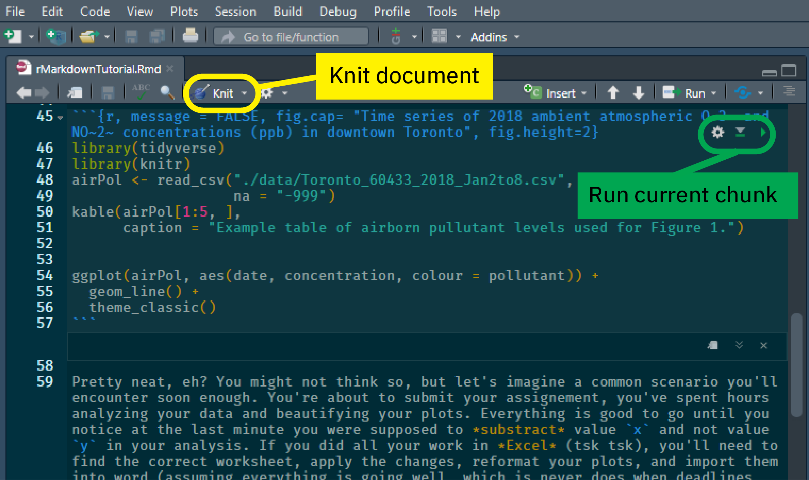

```{r setup, include=FALSE}
knitr::opts_chunk$set(echo = TRUE)
```

Howdy!

We understand that virtual classes may not have been what you had in mind when you signed up for a course titled *Laboratory and Field Methods in Environmental Science*, but it does provide us with a great oppertunity to really dive into what seperates science from a walk in the woods: writting stuff down! As you've probably already heard, the ENV 316 course will make prodigious use of R and RStudio as we explore concepts of environmental chemistry and ecology. Since you're already using R and RStudio for your data analysis and manipulations, we're encouraging you to submit your work using R Markdown. 

The aim of this document is to briefly explain what R Markdown is, why you should use it (hint: it'll make everyone's lives easier), and how to create simple documents for this course. 

## First off, what is R Markdown? 

In a nutshell, R Markdown allows you to analyse your data with R and write your report in the same place (this document is written with R Markdown). This has loads of benefits including increased reproducibility, and streamlined thinking. No more flipping back and forth between code and writing to figure out what's going on. Let's some some simple code as an example: 

```{r}
# Look at me go mom
x <- 2+2
x
```

What we've done here is write a snippet of R code, ran it, and printed the results (as they would appear in the console). While the above code isn't anything special, we can extend this concept so that our R markdown document contains any data, figures or plots we generate thoughout our analysis in R. For example: 

```{r, echo=FALSE, eval = FALSE}
# Quickly converts the CHM135 .csv files into tidyverse compatible format. 
# Not to be evaluate for the main document
library(tidyverse)
airPol <- read_csv("./data/Toronto_60433_2018_Day2to8.csv")

airPol <- airPol %>%
  pivot_longer(cols = NO2:O3, names_to = "pollutant", values_to = "concentration") %>%
  mutate(date = as.POSIXct(as.Date(Date, origin = "1899-12-30"))) %>%
  select(-Date)

write.csv(airPol, "./data/Toronto_60433_2018_Jan2to8.csv", row.names = FALSE)
#ggplot(airPol, Date, NO2

```

```{r, message = FALSE, fig.cap= "Time series of 2018 ambient atmospheric O~3~ and NO~2~ concentrations (ppb) in downtown Toronto", fig.height=2}
library(tidyverse) 
library(knitr)
airPol <- read_csv("./data/Toronto_60433_2018_Jan2to8.csv",
                   na = "-999")
kable(airPol[1:5, ], 
      caption = "Example table of airborn pullutant levels used for Figure 1.")


ggplot(airPol, aes(date, concentration, colour = pollutant)) +
  geom_line() +
  theme_classic()
```

Pretty neat, eh? You might not think so, but let's imagine a common scenario you'll encounter soon enough. You're about to submit your assignement, you've spent hours analyzing your data and beautifying your plots. Everything is good to go until you notice at the last minute you were supposed to *substract* value `x` and not value `y` in your analysis. If you did all your work in *Excel* (tsk tsk), you'll need to find the correct worksheet, apply the changes, reformat your plots, and import them into word (assuming everything is going well, which is never does when deadlines loom). Now if you did all your work in R markdown, you go to your one `.rmd` document, briefly apply the changes and compile your document.  

## How do I get started with R markdown?

As you've already guessed, R markdown documents use R and are most easily written and assembled in the RStudio IDE. If you have not done so, download R from the comprehensive R archive network (CRAN), link here: `http://cran.utstat.utoronto.ca/`, and RStudio, link here: `https://rstudio.com/products/rstudio/download/`). Follow the listed instructions and you should be well on your way. 

Once setup with R and RStudio, we'll need to install the `rmarkdown` and `tinytex` packages. In the console, simply run the following code:

```{r, eval = FALSE}
install.packages("rmarkdown") # downloaded from CRAN

install.packages("tinytex")
tinytex::install_tinytex()  # install TinyTeX

```

The `rmarkdown` package is what we'll use to generate our documents, and the `tinytex` package enables compiling documents as PDFs. There's a lot more going on behind the scenes, but you shouldn't need to worry about it. 

Now that everything is setup, you can create your first RMarkdown document by opening up RStudio, selecting `FILE -> NEW FILE -> Rmarkdown`. A dialog box will appear asking for some basic input parameters for your Rmarkdown document. Add your title and select PDF as your default output format (you can always change these later if you want). A new file should apear that's already populated with some basic script illustrating the key components of an R markdown document. 

## Great, now what's going on with this R markdown document?

Your first reaction when you opened your newly created R markdown document is probably that it doesn't look anything at all like something you'd show your TA. You're right, what you're seeing is the plain text code which needs to be compiled (called *knit* in RStudio) to create the final document. Let's break down what the R markdown syntax means then let's knit our document. 

The first chunk of any R mardown document will look something like this:

```{r, eval = FALSE}
---
title: "Untitled"
author: "David Hall"
date: "24/08/2020"
output: pdf_document
---
```

This section is known as the *preamble* and it's where you specify most of the document parameters. In the example we can see that the document title is "Untitled", it's written by your's truly, on the 24th of August, and the default ouput is a PDF document. You can modify the preamble to suit your needs. For example, if you wanted to change the title you would write `title: "New Title"` in the preamble. Note that none of this is `R` code, rather it's `YAML`, the syntex for the document's metadata. Apart from what's shown you shouldn't need to worry about this much, just remember that indentation in YAML matters. 

Reasing further down the default R markdown code, you'll see different blocks of text. In R markdown anything you write will be interpreted as body text (i.e .the stuff you want folks reading) in the knitted document. **To actually run R code** you'll need to do one of the following:

- **Setup a code chunk**. Code chunks start with three backticks like this: ` ```{r}`, where `r` indicates you're using the R languauge. End a code chunk using three more backticks like this ` ``` `.

  - Specify code chunks in the curly braces. i.e. ` ```{r, fig.height = 2}` sets figure height to 2 inches.
  
- **Inline code expression**, which starts with ` `r` and ends with ` ``. 

  - Earlier we calculated `x <- 2 + 2`, we can use inline expressions to recall that value (i.e. We found that *x* is `r x`)
 
 A screenshot of how this document, the one you're reading, appeared in RStudio is shown in Figure 2.   
  


## How do I go from R markdown to something I can hand-in

To knit (or compile) your're R markdown script, simply click the  *knit* button in RStudio (yellow box, Figure 2). You can specifiy what output you would like and RStduio will (hopefully) compile your script. 

If you want to test how your code chunks will run, RStudio shows a little green 'play button' on the top right of every code chunk. Clicking this will run your code chunk and output whatever it would in the final R markdown document. This is a great way to tweak figures and codes as it avoids the need to compile the entire document to check if you managed to change the lines from 'black' to 'blue' in your plot. 

